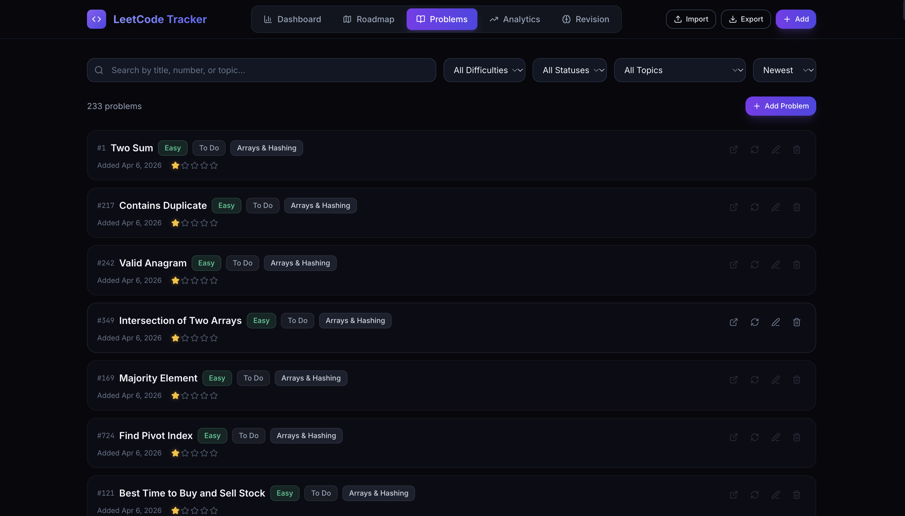
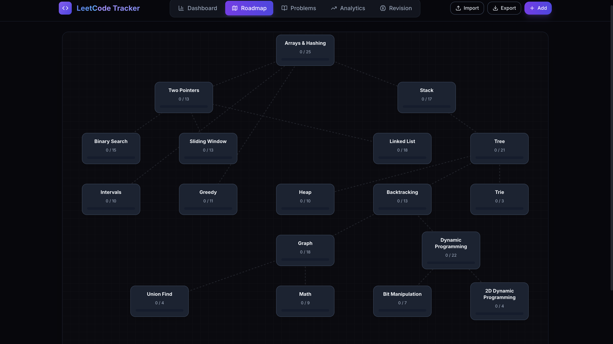

# Supercode

A continuous progress tracker for LeetCode. This React-based application is designed to help developers monitor their problem-solving roadmap and visualize conceptual learning paths across data structures and algorithms.

<p>
  
  
  <a href="https://github.com/Mahizhan-S/Supercode/stargazers"></a>
  
</p>

## Features

- **Interactive Roadmap**: View and navigate through structured learning paths spanning multiple computer science concepts.
- **Progress Tracking**: Manage state for solved problems, pending challenges, and questions flagged for review.
- **Client-Side Architecture**: Lightweight local state management providing immediate response times without external database dependencies.

## Interface Overview




## Tech Stack

- **Framework**: React, Vite
- **Styling**: Component-scoped CSS
- **Deployment**: Standard Node/NPM toolchain

## Getting Started

### Prerequisites

- Node.js (v14.0.0 or later)
- npm or yarn

### Installation

1. Clone the repository:
   ```bash
   git clone https://github.com/Mahizhan-S/Supercode.git
   cd Supercode
   ```

2. Install the project dependencies:
   ```bash
   npm install
   ```

3. Boot the development server:
   ```bash
   npm run dev
   ```

4. Access the application locally at `http://localhost:5173`.

## Project Structure

```text
Supercode/
├── src/
│   ├── components/       # Primary views and React components
│   │   └── ui/           # Reusable generic interface elements
│   ├── data/             # Persistent seed data and state constants
│   ├── App.jsx           # Root component
│   └── styles.css        # Base stylesheet
├── public/               # Static assets
└── leetcode.sh           # Auxiliary shell utility
```

## Contributing

Contributions to Supercode are welcome. To contribute:

1. Fork the repository
2. Create a feature branch (`git checkout -b feature/YourFeature`)
3. Commit your changes (`git commit -m 'Add SomeFeature'`)
4. Push to the branch (`git push origin feature/YourFeature`)
5. Open a Pull Request

Please ensure your code adheres to the existing style and includes appropriate documentation.

## License

This project is distributed under the MIT License. See the `LICENSE` file for details.
