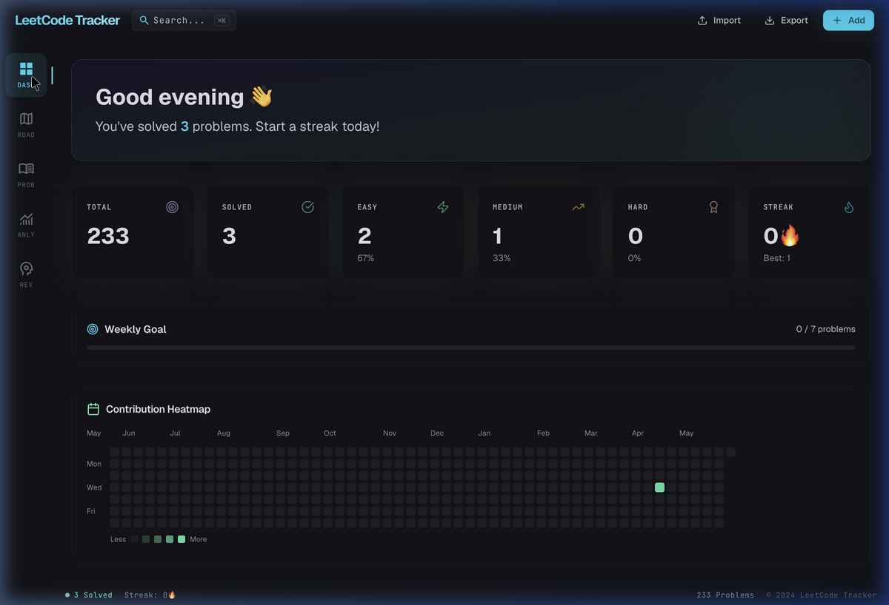
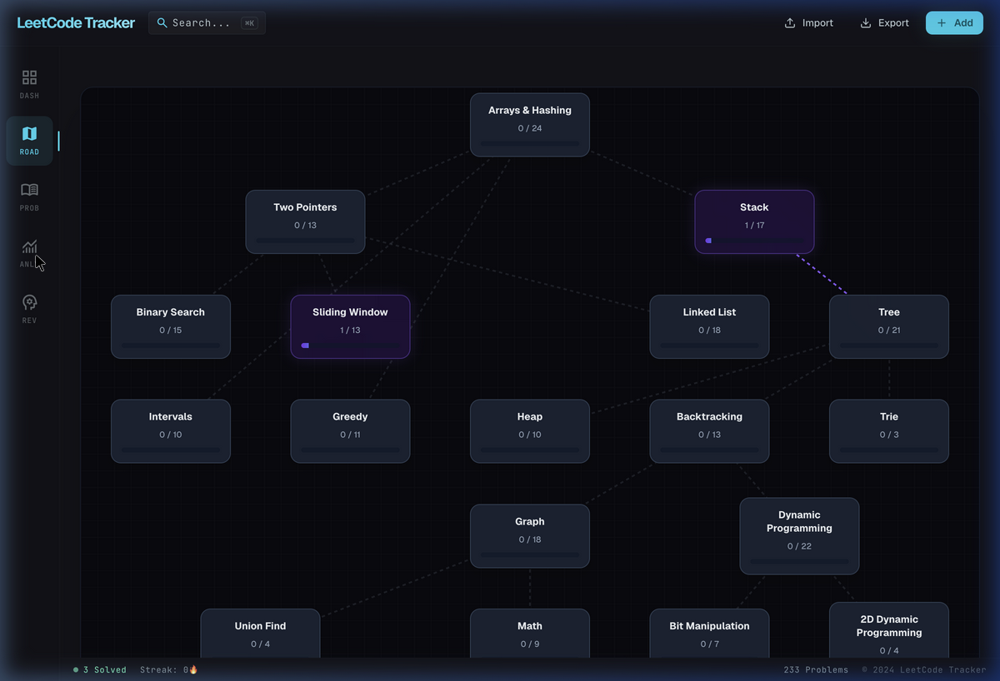
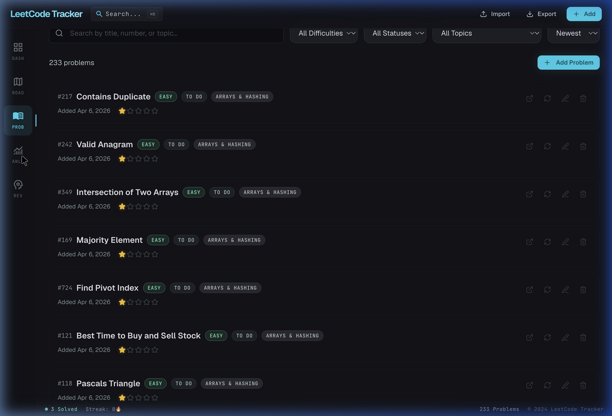
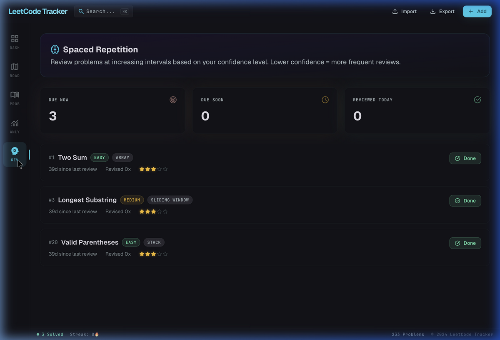

<div align="center">

# ⚡ Supercode

**A high-performance LeetCode progress tracker built for serious problem solvers.**

Track your progress, visualize your skill roadmap, and never forget a solution with spaced repetition — all wrapped in a premium Deep Space Pro interface.

[](https://react.dev)
[](https://vitejs.dev)
[](https://tailwindcss.com)
[](LICENSE)
[](https://github.com/Mahizhan-S/Supercode/stargazers)

</div>

---

## ✨ Features

| Feature | Description |
|---------|-------------|
| 📊 **Dashboard** | At-a-glance stats — solved count, difficulty breakdown, weekly goal, streak tracker, and a GitHub-style contribution heatmap |
| 🗺️ **Skill Roadmap** | Interactive NeetCode-style topic graph with progress bars per category, showing your learning path across 20+ DSA topics |
| 📝 **Problem Manager** | Full CRUD for 233 seeded problems with multi-filter search (difficulty, status, topic), sorting, and inline actions |
| 📈 **Analytics** | Cumulative progress charts, difficulty distribution donut, top topics bar chart, and per-difficulty progress bars |
| 🧠 **Spaced Repetition** | Intelligent revision queue based on confidence levels — surfaces problems at optimal intervals so you never forget |
| 💾 **Local Persistence** | All data stored in `localStorage` with JSON import/export for portability |

## 🖥️ Screenshots

### Dashboard


### Skill Roadmap


### Problem Manager


### Analytics


### Spaced Repetition


## 🎨 Design System

Supercode uses the **Deep Space Pro** design system — an ultra-dark, glassmorphic interface engineered for focus and readability during long coding sessions.

| Token | Value |
|-------|-------|
| Background | `#131319` Obsidian |
| Primary | `#22d3ee` Electric Cyan |
| Success | `#68f5b8` Matrix Green |
| Secondary | `#d0bcff` Muted Violet |
| Heading Font | [Geist](https://vercel.com/font) |
| Mono Font | [JetBrains Mono](https://www.jetbrains.com/lp/mono/) |
| Glass Effect | `blur(12px)` + `rgba(19,19,25,0.55)` |
| Borders | 1px razor — `rgba(60,73,76,0.12)` |

## 🛠️ Tech Stack

- **Framework** — React 18 + Vite 5
- **Styling** — Tailwind CSS (CDN) + Deep Space Pro design tokens
- **Charts** — Recharts
- **Icons** — Lucide React + Google Material Symbols
- **Fonts** — Geist, JetBrains Mono
- **Storage** — Browser localStorage

## 🚀 Getting Started

### Prerequisites

- Node.js v16+ and npm

### Installation

```bash
# Clone the repository
git clone https://github.com/Mahizhan-S/Supercode.git
cd Supercode

# Install dependencies
npm install

# Start the development server
npm run dev
```

Open [http://localhost:5173](http://localhost:5173) in your browser.

### Build for Production

```bash
npm run build
npm run preview
```

## 📁 Project Structure

```
Supercode/
├── src/
│   ├── components/
│   │   ├── Roadmap.jsx        # Interactive skill tree graph
│   │   └── ui/                # Reusable UI primitives
│   │       ├── badge.jsx      # Difficulty & status badges
│   │       ├── button.jsx     # Primary, outline, ghost buttons
│   │       ├── card.jsx       # Glass card containers
│   │       ├── input.jsx      # Text inputs
│   │       ├── progress.jsx   # Progress bars
│   │       └── textarea.jsx   # Text areas
│   ├── data/
│   │   ├── seedProblems.js    # 233 curated LeetCode problems
│   │   └── roadmapData.js     # Skill tree topology
│   ├── App.jsx                # Root component & all views
│   ├── main.jsx               # React entry point
│   └── styles.css             # Deep Space Pro design system
├── screenshots/               # App screenshots
├── index.html                 # Vite entry with Tailwind CDN
└── package.json
```

## 🤝 Contributing

Contributions are welcome. Please follow these steps:

1. Fork the repository
2. Create a feature branch (`git checkout -b feature/your-feature`)
3. Commit your changes (`git commit -m 'feat: add feature'`)
4. Push to the branch (`git push origin feature/your-feature`)
5. Open a Pull Request

## 📄 License

Distributed under the MIT License. See [`LICENSE`](LICENSE) for details.

---

<div align="center">
  <sub>Built with ☕ and a deep appreciation for consistent problem solving.</sub>
</div>
